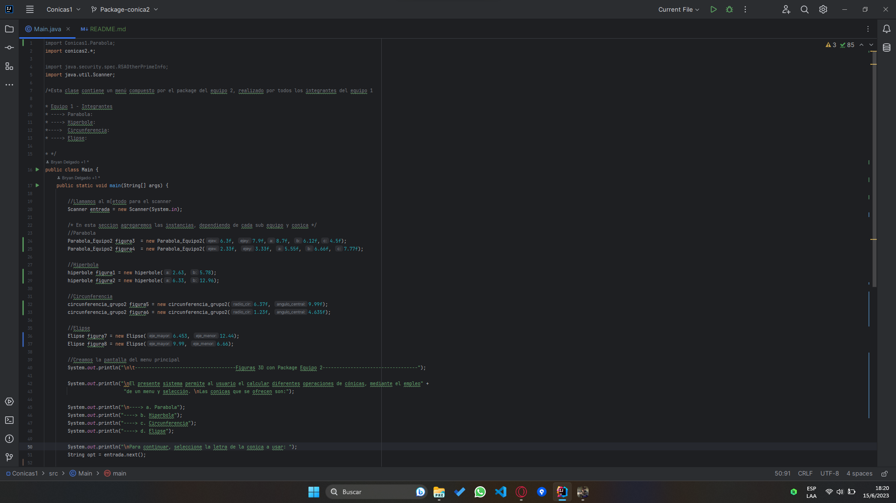
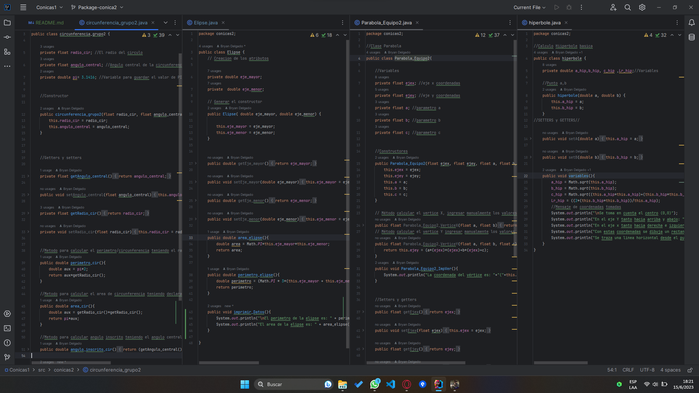
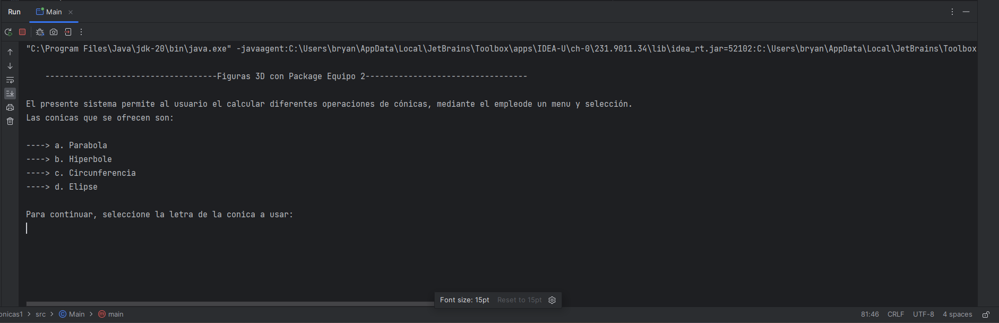
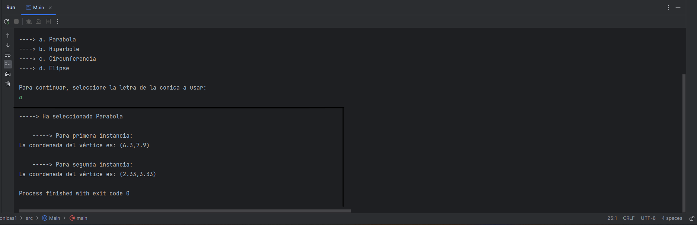
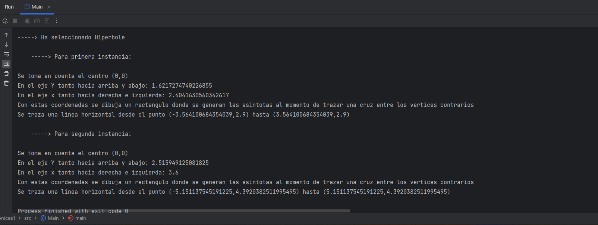
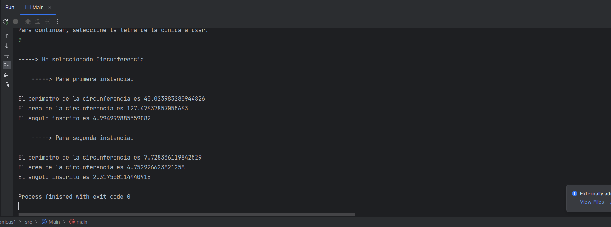
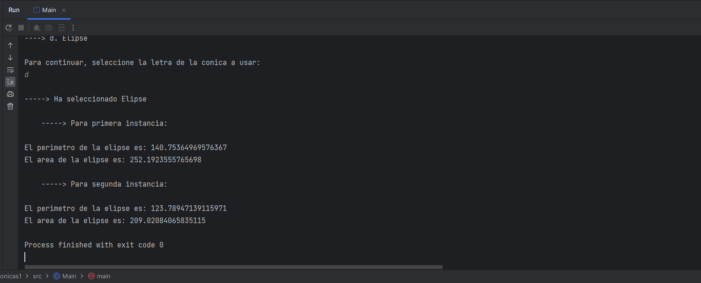

# Packages en Java
Realizado por: Bryan Delgado
Fecha: 15-Junio-2023

## Contenido

 - Main Class (Contiene el menú que permite acceder a una variedad de ejercicios de cónicas)
 - Packages (Contiene los archivos de las clases de cónicas tanto del Equipo 1 como el Equipo2)

## Instrucciones
Los miembros del equipo1 van a implementar un menú mostrando el uso e implementación de objetos del package del equipo2 y viceversa.  

https://github.com/Mino-Mateo/Trabajo_Grupo_2.git  

https://github.com/bryandelgado99/Conicas-1.git  

Entregables: link del repositorio de GitHub con capturas de pantalla en el "README.md".

## Capturas del programa en ejecución

 1. Código del Main
	
    2. Package del Equipo 2
    
 3. Ejecución del archivo Main:
	1. Main:
	
	2. Parábola:
	
	3. Hipérbola:
	
	4. Circunferencia:
	
	5. Elipse:
	

